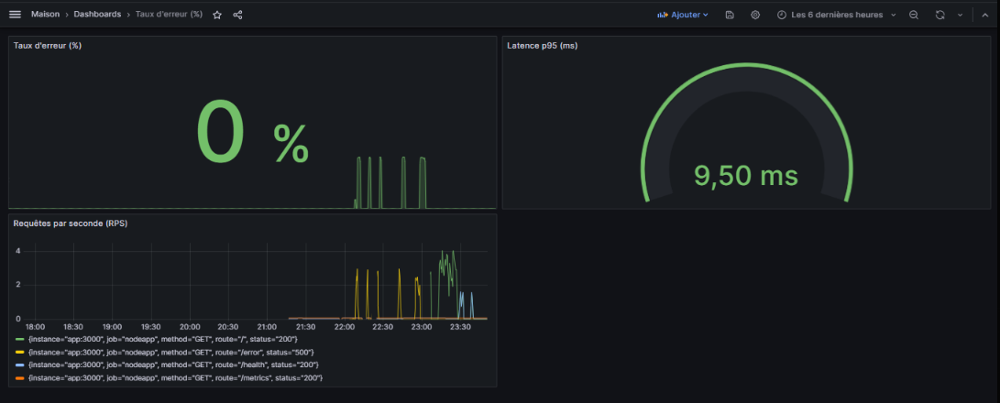
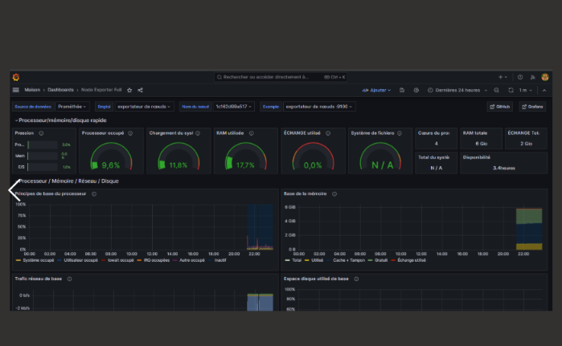
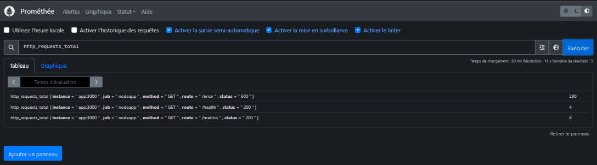

# 📊 DevOps Monitoring Project

## 🔹 1. Dashboard -- Application Monitoring

This dashboard shows: - Error rate (%) - Latency p95 (ms) - Requests per
second (RPS)

------------------------------------------------------------------------

## 🔹 2. Node Exporter -- System Metrics

This dashboard displays: - CPU usage - RAM usage - Disk usage - Network
traffic

------------------------------------------------------------------------

## 🔹 3. Prometheus Metrics Verification

Here we verify that Prometheus correctly collects application metrics
such as: - `http_requests_total` - Status codes (200, 500, etc.) -
Route-specific metrics

------------------------------------------------------------------------

## 🚀 Technologies Used

-   Docker
-   Prometheus
-   Grafana
-   Node Exporter
-   Node.js

------------------------------------------------------------------------

## ✅ Objectives

-   Monitor application performance
-   Monitor system resources
-   Visualize metrics in Grafana
-   Validate metrics collection with Prometheus
